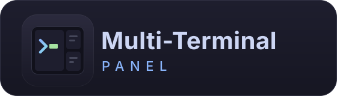

<p align="center">
  
</p>

<p align="center"><em>Every terminal, every agent, one deck.</em></p>

<p align="center">
  <a href="https://github.com/atik806/AgentDeck/releases/latest"></a>
  
  
  <a href="LICENSE"></a>
</p>

---

**AgentDeck** is a Windows multi-terminal panel built for driving coding agents.
Open a grid of **real terminals** in one window, pick a coding agent
(Claude Code, Codex, Gemini CLI, …), and it auto-runs in every pane. Group panes
into **workspaces**, talk to your agent with **voice input**, and keep your setup
**synced across machines** through a Google sign-in.

Panes are genuine pseudo-consoles (`CreatePseudoConsole`), not textboxes wired to
a pipe — so colour, line editing, arrow keys, `cls`, `vim`, `less` and a
full-screen TUI all behave exactly as they do in Windows Terminal.

## Highlights

- **A deck of real terminals** — 1–16 panes per workspace in grid / column / row
  layouts, resizable, each a true ConPTY shell (PowerShell 7, Windows PowerShell,
  Command Prompt, or Git Bash).
- **Agent-aware** — a setup wizard picks the coding agent that auto-runs in every
  terminal. Knows **Claude Code, Codex, GitHub Copilot CLI, Gemini CLI, Cursor
  Agent, opencode, Amp, Antigravity CLI, Qwen Code, Crush, Aider, Goose**, plus
  plain shell and a custom command. Not-installed agents show a one-click install
  hint.
- **Workspaces** — independent groups of panes in a sidebar; switch instantly,
  shells keep running and scrollback stays intact in the background.
- **Voice-to-text** — a floating widget transcribes speech locally
  (whisper.cpp) and types it at the active prompt, no Enter, so you read before
  you run. `Ctrl+Shift+X` to toggle.
- **Accounts & cloud sync** — sign in with Google (Supabase); your working
  folder, recent folders, agent choice, layout, font and theme follow you to
  every machine.
- **Self-updating** — installed builds carry an in-app **Update** button and a
  quiet check on launch. Updates are per-user file swaps, no admin prompt.
- **Light & dark** — full theming, follows the system or pin it.
- **Claude Code folder-trust** is pre-accepted for your working folder, so panes
  open straight into the session.

## Free vs Pro

| | Free | Pro |
|---|---|---|
| Terminal panes | up to 4 | up to 16 |
| Workspaces | 1 | unlimited |
| Coding agents | all 12 | all 12 |
| Layouts | grid / column / row | grid / column / row |
| Voice-to-text input | — | ✓ |
| Cloud settings & profile sync | — | ✓ |
| Background auto-updates | manual button | one-click on launch |
| Per-workspace folders & agents | — | ✓ |
| Support | community | priority email |

Pro is sold monthly or yearly; a plan **automatically reverts to Free when its
term ends**. See [`vibeflow.tech/agentdeck`](https://vibeflow.tech/agentdeck).

## Install

Grab `AgentDeck-win-Setup.exe` from the
[latest release](https://github.com/atik806/AgentDeck/releases/latest) and run
it. It installs per-user to `%LOCALAPPDATA%\AgentDeck\`, no admin prompt. Builds
are currently **unsigned**, so Windows SmartScreen shows a warning the first time
— click **More info → Run anyway**. A portable `.zip` is attached to each release
too.

**Requirements** — Windows 10 1809+ or Windows 11, and at least one of
PowerShell 7 / Windows PowerShell / Command Prompt / Git Bash. A signed-in
Google account is required on first launch.

## Run from source

```cmd
cd windows_launcher
python -m venv .venv
.venv\Scripts\activate
pip install -r requirements.txt
python main.py
```

Python 3.10+. The developer guide — architecture, the ConPTY / pyte internals,
and the test suites — is in
[`windows_launcher/README.md`](windows_launcher/README.md).

## Repository layout

| Path | What it is |
|---|---|
| [`windows_launcher/`](windows_launcher/) | The AgentDeck app (PySide6 + ConPTY). Start here. |
| [`voice_capture/`](voice_capture/) | Standalone voice-to-text pipeline (whisper.cpp + VAD); its Qt-free modules are imported by the app. |
| [`packaging/`](packaging/) | PyInstaller + [Velopack](https://velopack.io) build and release scripts. |
| [`supabase/`](supabase/) | Database migrations for accounts, settings sync, crash reports and plan expiry. |
| [`docs/`](docs/) | [`ACCOUNTS.md`](docs/ACCOUNTS.md) — Supabase setup, sign-in, cloud sync and subscription expiry. |
| [`assets/`](assets/) | App icon and wordmark sources. |
| `context.md` | Running engineering log. |

## Building a release

Bump `windows_launcher/version.py`, commit, then push a `vX.Y.Z` tag —
[`.github/workflows/release.yml`](.github/workflows/release.yml) builds the
Windows app and publishes it to GitHub Releases with a Velopack update feed.
Details in [`packaging/README.md`](packaging/README.md).

## License

[MIT](LICENSE) © 2026 Atik Shahriar
